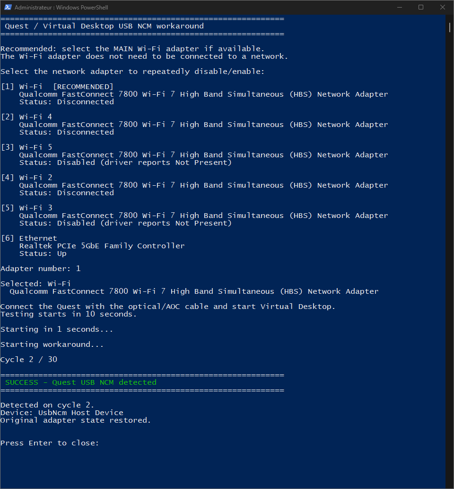

# Quest / Virtual Desktop USB NCM Workaround

A PowerShell workaround for some Meta Quest users whose Virtual Desktop USB
connection gets stuck in a USB reset/re-enumeration loop when using certain
active optical (AOC/fiber) USB cables.

The script repeatedly toggles a network adapter selected by the user until a
stable Meta Quest USB CDC-NCM interface is detected.

## Requirements

- Windows PowerShell 5.1 or later
- Windows `NetAdapter` and `PnpDevice` cmdlets
- Administrator privileges
- A Meta Quest using Virtual Desktop USB mode

## Usage

Download:

`Quest_VD_USB_NCM_Workaround.ps1`

If PowerShell allows local scripts, run:

```powershell
.\Quest_VD_USB_NCM_Workaround.ps1
```

If your execution policy blocks the script, run it without changing the user or
machine execution policy:

```powershell
powershell.exe -NoProfile -ExecutionPolicy Bypass -File .\Quest_VD_USB_NCM_Workaround.ps1
```

The script requests administrator elevation automatically.

Then:

1. Connect the Quest with the optical/AOC USB cable and start Virtual Desktop.
2. Verify that "Allow to connect over USB" is checked in settings tab.
3. When prompted by the script ,select a target network adapter. Wi-fi usually works.
4. If the connect/disconnect loop does not occur, replug the cable once.
5. Let the script run until Quest USB NCM is detected.

**Note** : The target network adapter does not need to be connected to a network during the process.

## What the script does

- Toggles only the physical network adapter selected by the user.
- Verifies that adapter state changes complete successfully.
- Waits for a stable Meta Quest USB NCM interface before reporting success.
- Restores the selected adapter to its original state whenever possible.

Quest NCM detection is restricted to Meta/Oculus USB vendor ID `VID_2833`;
no Quest product PID is hard-coded.

## Notes and limitations

This is a community workaround, not a fix for the underlying Meta USB
enumeration behavior.

Results can vary with Quest firmware, Windows/NDIS versions, network drivers,
Wi-Fi implementations, active optical cable electronics.

On some systems, toggling Ethernet may not trigger the workaround while
toggling the main Wi-Fi interface does.

No script can guarantee restoration if PowerShell is forcibly terminated or the
computer is shut down while the selected adapter is being toggled.

